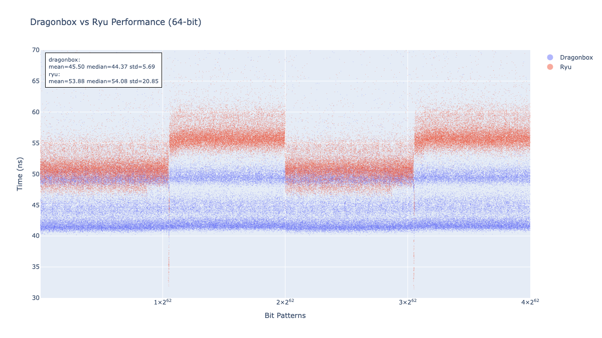
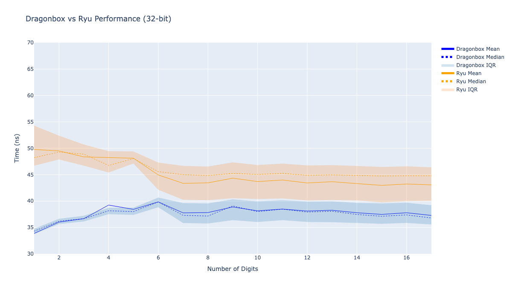

# Dragonbox Benchmarks

Benchmark, fuzz test, and profile the Dragonbox algorithm using a locally built Go compiler and standard library.

## Setup

Clone the repository with its submodule:

```console
git clone --recurse-submodules git@github.com:taichimaeda/dragonbox-bench.git
```

Build the Go compiler and standard library:

```console
cd ./go/src
./make.bash
```

### Benchmarking

Run benchmarks using your local Go build:

```console
export PATH="$PWD/go/bin:$PATH"
go run src/bench/main.go
```

### Fuzz Testing

Run fuzz tests to check correctness across many inputs:

```console
export PATH="$PWD/go/bin:$PATH"
go run src/fuzz/main.go
```

### Profiling

Collect CPU and memory usage data:

```console
export PATH="$PWD/go/bin:$PATH"
go run src/profile/main.go
```

## Results

The following benchmarks were run on an M1 MacBook Air (8 cores/16GB memory). 

Each chart shows performance of the Dragonbox algorithm under different input scenarios:

  
  
  

